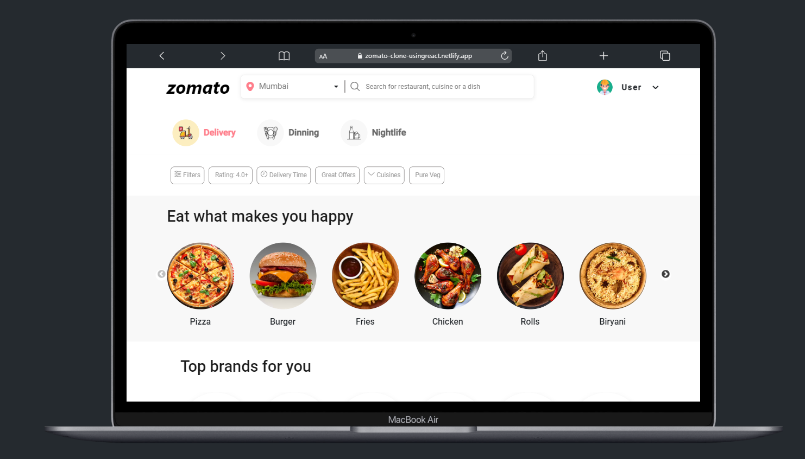

# Zomato UI Clone - Using React

A Zomato UI Clone Using ReactJs

• In this Clone the API Data is taken from Zomato Website.

• This Clone is just for Educational purposes as a Personal Project.

• Only Some part of the Zomato api data is used beacuse creating such big api data for such small clone is not economical.

• Hosted Clone Site Link : <https://zomato-clone-usingreact.netlify.app>

## Authors

- [@shubhammore](https://github.com/more1251)

## Features

- UI Clone

## Tech Stack

**Client:** React, Bootstrap

**Npm packages:**  React Router,react-slick

**React Hooks:**  useEffect,useState

# Installation

Create the react app using: npx create-react-app

## Run Locally

Run the Front End on Local Host : <http://localhost:3000>
